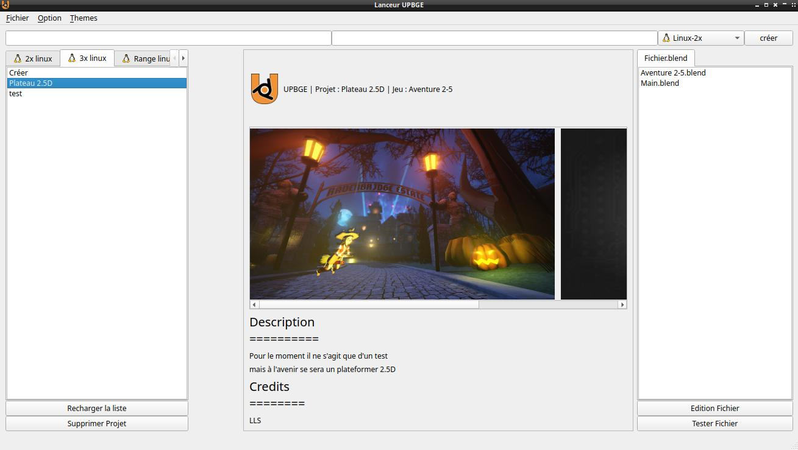
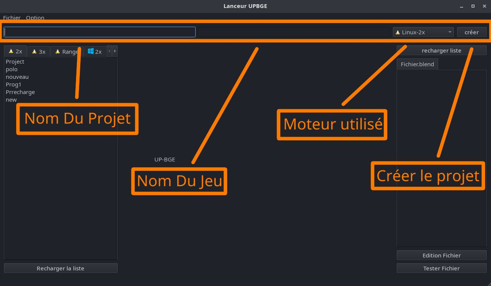
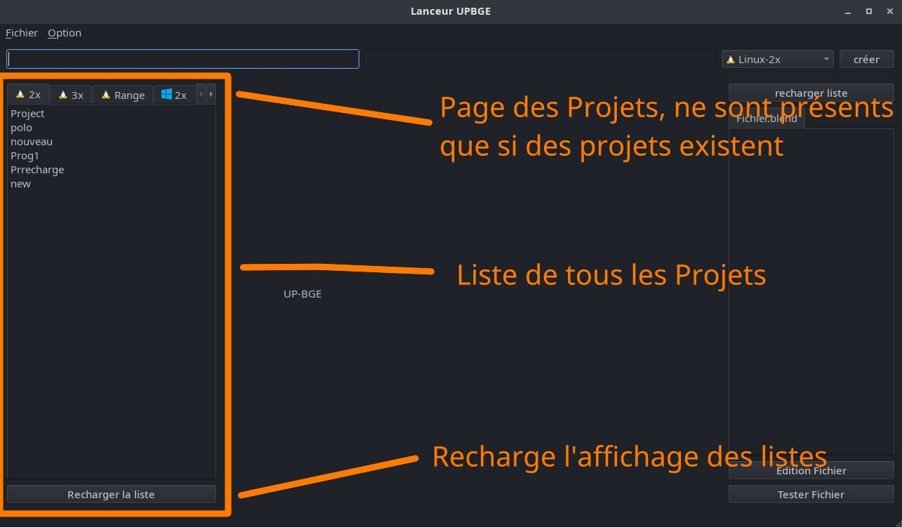
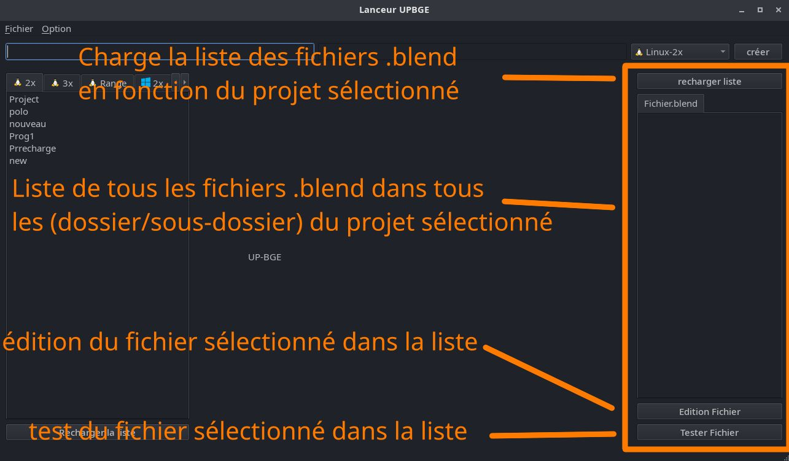

# Lanceur_upbge
un lanceur et gestionnaire de projet UP(BGE)

- dépendence pip :
    - requis :
        - PySide6
    - pour la documentation:
        - sphinx
        - furo

utilisez la commande suivante:
```
pip install -r dependence.txt
```

## Utilisation

```
python3 -m source.lanceur
```
## interface


## Zone de création de nouveau projet


## Liste de projet


## Liste de fichier .blend

---
# Linux
utilisation de wine pour les projets sous Windows

```bash
sudo dpkg --add-architecture i386
sudo apt update
sudo apt install wine64 wine32 wine winetricks
```
---
# Construction du projet
```bash
# cloner le projet
git clone https://github.com/LLS-lopos/Launcher_upbge.git
# naviguer dans le pr

cd Launcher_upbge
mkdir nuitka_build && cd nuitka_build
# construction
nuitka3 --standalone --plugin-enable=pyside6 ../source/lanceur.py --include-data-files=../source/data/Moteur/*.svg=./data/Moteur/ --include-package=GUI --include-package=program
```
---
Projet en cours de conception