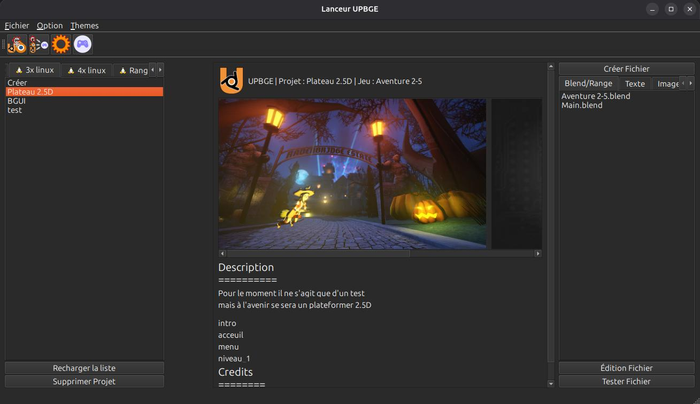

# Lanceur_upbge
un lanceur et gestionnaire de projet UP(BGE)

- dépendence pip :
    - requis :
        - PySide6
    - pour la documentation:
        - sphinx
        - furo

utilisez la commande suivante:
```
pip install -r dependence.txt
```

## Utilisation

```
python3 -m source.lanceur
```
## interface


## Zone de création de nouveau projet


## Liste de projet


## Liste de fichier .blend

---
Projet en cours de conception