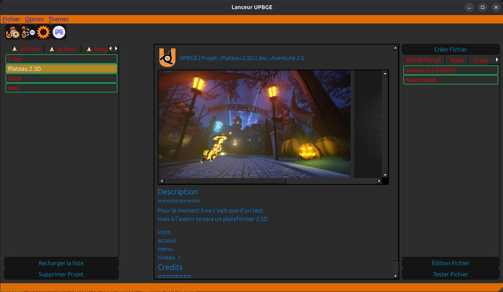
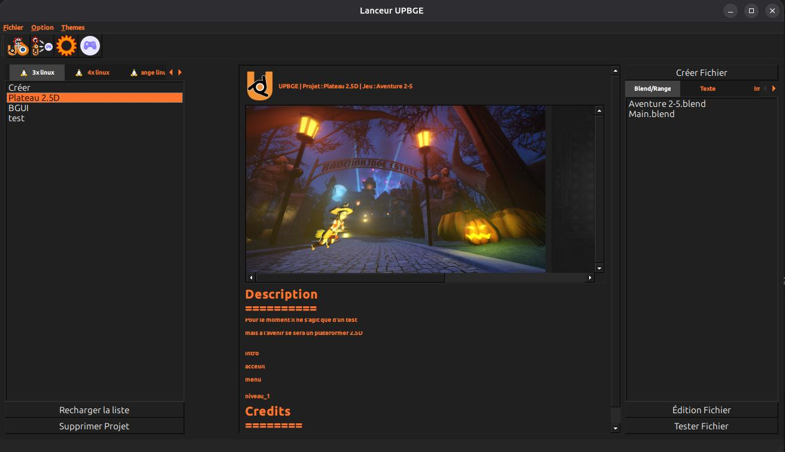

# Lanceur_upbge
### un lanceur et gestionnaire de projet UP(BGE) *Python 3.12 recommendé*

[demo YT](https://www.youtube.com/watch?v=n0BAvpPFKBU)

- dépendence pip :
    - requis :
        - PySide6
    - pour la documentation:
        - sphinx
        - furo
    - pour créer un exécutable:
        - nuitka

utilisez la commande suivante:
```
pip install -r dependence.txt
```

## Utilisation

```
python3 source/lanceur.py
```
---
# Linux
utilisation de wine pour les projets sous Windows

### apt (Debian)
```bash
sudo dpkg --add-architecture i386
sudo apt update
sudo apt install wine64 wine32 wine winetricks
```
### dnf (Fedora)
```bash
sudo dnf install wine.i686 wine.x86_64
```
### pacman (Arch Linux)
```bash
sudo pacman -S wine
```
### zypper (OpenSUSE)
```bash
sudo zypper install wine
```
### emerge (Gentoo)
```bash
sudo emerge app-emulation/wine
```
### snap
```bash
sudo snap install wine
```
### flatpak
```bash
flatpak install flathub org.winehq.Wine
```
---
# Construction du projet
```bash
# cloner le projet
git clone https://github.com/LLS-lopos/Launcher_upbge.git
# naviguer dans le projet
cd Launcher_upbge
mkdir nuitka_build && cd nuitka_build
```

## build linux
```bash
nuitka3 --standalone --plugin-enable=pyside6 ../source/lanceur.py --include-data-dir=../source/data/icone=./data/icone --include-data-files=../source/Scripts/*.py=./Scripts/ --include-data-dir=../source/style=./style --include-package=GUI --include-package=program --include-package=Biblio
```
## build windows
```bash
python -m nuitka --mingw64 --standalone --disable-ccache --lto=no --plugin-enable=pyside6 --include-package=PIL ../source/lanceur.py --include-data-dir=../source/data/icone=./data/icone --include-data-files=../source/Scripts/*.py=./Scripts/ --include-data-dir=../source/style=./style --include-package=GUI --include-package=program --include-package=Biblio --verbose
```
---
## interface && Style
[Feuille de style](https://qss-stock.devsecstudio.com/index.php) sous licences MIT
- fusion

- windows

- standard

- combinear

- diffnes

- genetive

- Windows Vista (Windows)

---
# TODO

    ajouter un support blender
    rendre plus efficace la reconnaissance des exécutable logiciel
    ajouter un visualiseur d'images
    ajouter un visualiseur de vidéo
    ajouter une meilleurs gestion d'affichage (interface/projet)
---
Projet en cours de conception